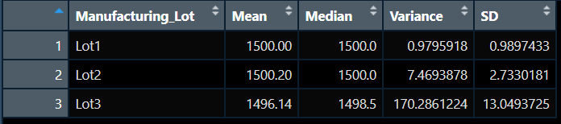
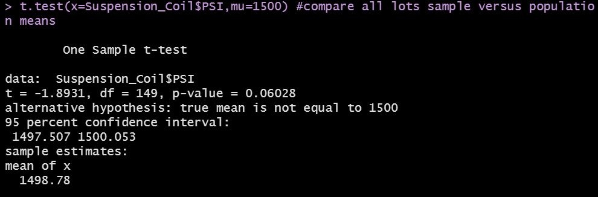
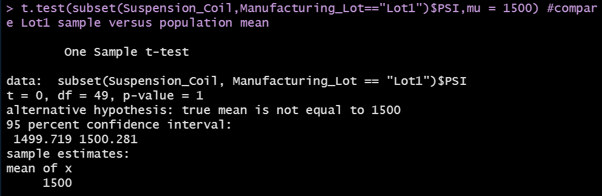
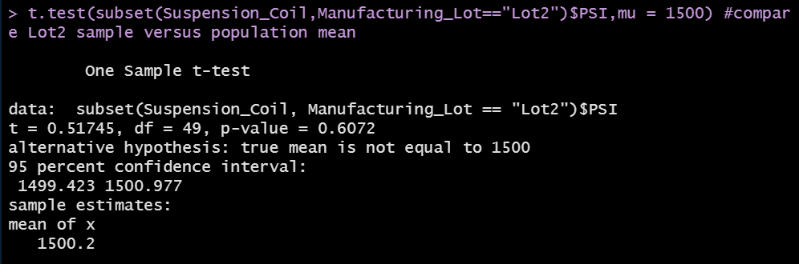
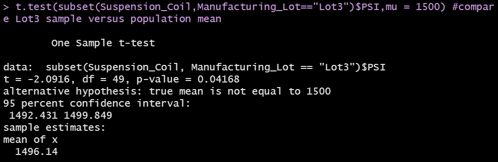

# MechaCar Statistical Analysis

## Linear Regression to Predict MPG

Using R and RStudio, a multiple linear regression model was created for the MechaCar MPG dataset to predict the relationship between MPG and five metrics: vehicle length, vehicle weight, spoiler angle, ground clearance, and drivetrain. 

The results are as follows:

*1. Which variables/coefficients provided a non-random amount of variance to the mpg values in the dataset?*

Vehicle length and ground clearance both provided non-random amounts of variance to the mpg values in the dataset.

*2. Is the slope of the linear model considered to be zero? Why or why not?*

The slope of the multiple linear regression model is not considered to be zero since the r-squared value is 0.71 and the p-value is 5.35e-11, which is much smaller than the assumed significance level of 0.05%.

*3. Does this linear model predict mpg of MechaCar prototypes effectively? Why or why not?*

The linear model predicts mpg of MechaCar prototypes effectively since the r-squared value is 0.71, meanihng about 71% of the variablilty of mpg is explained using this linear model, and the p-value is significant.

## Summary Statistics on Suspension Coils

*The design specifications for the MechaCar suspension coils dictate that the variance of the suspension coils must not exceed 100 pounds per square inch. Does the current manufacturing data meet this design specification for all manufacturing lots in total and each lot individually? Why or why not?*

**Total Summary**

The current total manufacturing data meets the design specifications with a variance of 62.29.

**Lot Summary**

However, the current lot manufacturing data shows that Manufactoring Lot 3 does not meet the design specifications with a variance of 170.23. Manufacturing Lots 1 and 2 meet the design design specifications, so action only needs to be taken at Manufactoring Lot 3.

## T-Tests on Suspension Coils

