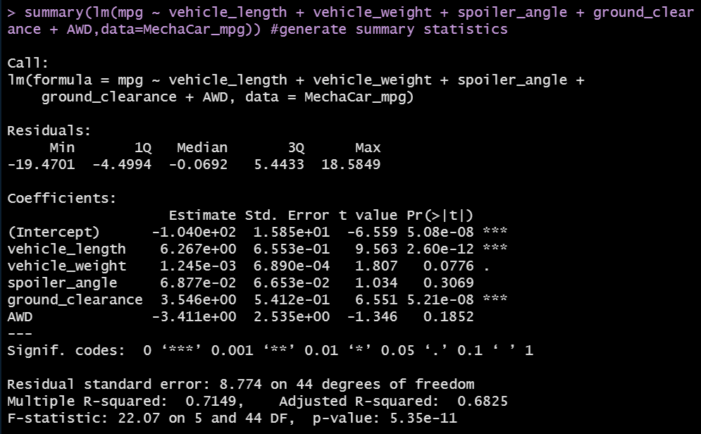

# mechacar_statistical_analysis

## Linear Regression to Predict MPG

Using R and RStudio, a multiple linear regression model was created for the MechaCar MPG dataset to estimate the relationship between MPG and five metrics: vehicle length, vehicle weight, spoiler angle, ground clearance, and drivetrain. 

The results are as follows:

*1. Which variables/coefficients provided a non-random amount of variance to the mpg values in the dataset?*

Vehicle length and ground clearance are statistically unlikely to provide random amounts of variance to the linear model.

*2. Is the slope of the linear model considered to be zero? Why or why not?*

The slope of the multiple linear regression model is not considered to be zero since the r-squared value is 0.71 and the p-value is 5.35e-11, which is much smaller than the assumed significance level of 0.05%.

*3. Does this linear model predict mpg of MechaCar prototypes effectively? Why or why not?*

The linear model predicts mpg of MechaCar prototypes effectively since the r-squared value is 0.71, meanihng about 71% of the variablilty of mpg is explained using this linear model, and the p-value is significant.
